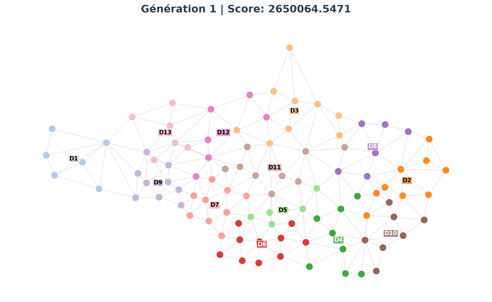
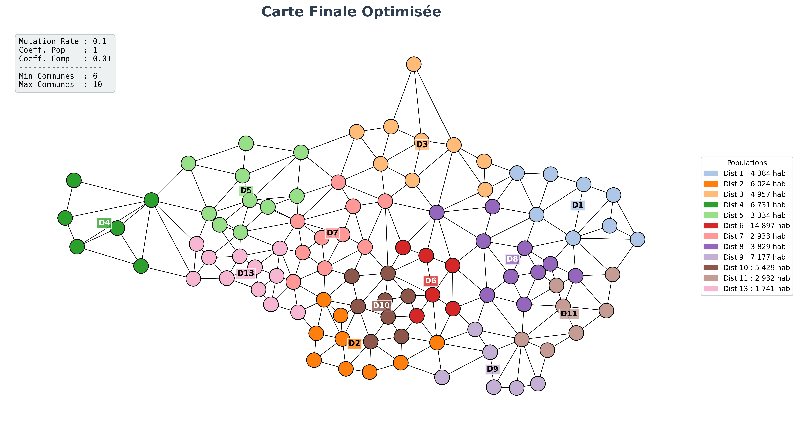
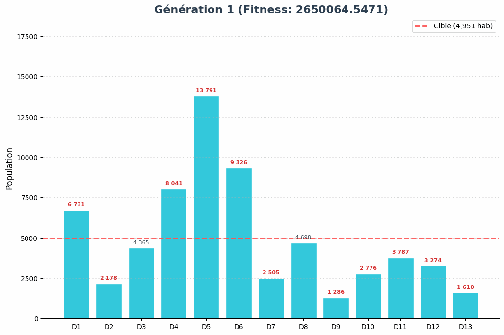

# Territorial-partitioning-genetic-algorithm
A custom Python-based genetic algorithm designed to solve NP-hard territorial partitioning problems by optimizing demographic balance and geometric compactness under strict spatial connectivity constraints.

# Key Features

**Graph-Based Modeling:** Represents territories as dual graphs using NetworkX.

**Connectivity-Aware Operators:** Custom crossover and mutation functions designed to prevent district fragmentation.

**Multi-Objective Optimization:** Balances demographic parity and geometric compactness (Isoperimetric Quotient).

**From Scratch Implementation:** Built without black-box optimization libraries to allow full control over spatial heuristics.

# Tech Stack
**Language:** Python 3.11+

**Libraries:** NetworkX (Graph Theory), Pandas (Data handling), Matplotlib (Visualization).

#  Visual Results

**Final Partitioning Map:**

**Example of the algorithm generating 13 connected and balanced districts:**

**Example of the evolution of populations per district:**

